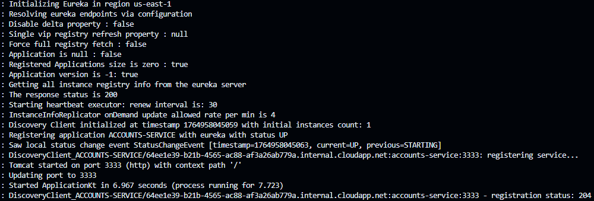
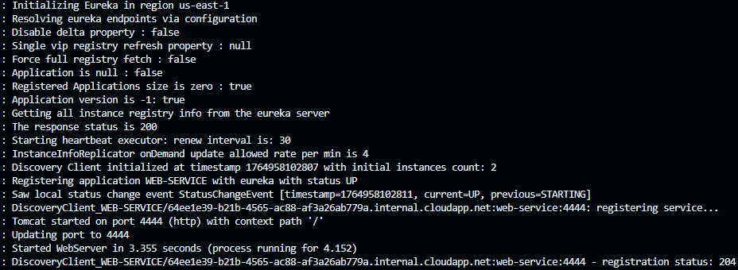
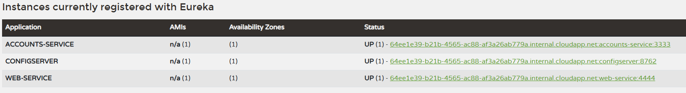
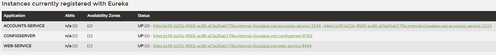
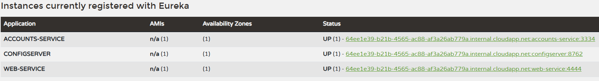

# English Version

# Lab 6 Microservices - Project Report

## 1. Configuration Setup

**Configuration Repository**: (https://github.com/Lizerat/lab6-microservices.git)

Describe the changes you made to the configuration:

- **What did you modify in `accounts-service.yml`?**

I did not modify the configuration apart from changing the port where the service runs, allowing me to launch a second instance on a different port later on.

- **Why is externalized configuration useful in microservices?**

Because it centralizes configuration and allows managing it consistently. Updating a service only requires modifying the external configuration and restarting that service, without changing its code.

---

## 2. Service Registration (Task 1)

### Accounts Service Registration

Explain what happens during service registration.

The service registers itself in Eureka by submitting its instance information so it can be discovered by other services. During startup, it also retrieves the current Eureka registry, allowing it to locate and interact with any other microservices already registered.

### Web Service Registration

Explain how the web service discovers the accounts service.

The web service discovers the accounts service through Eureka, which maintains an up-to-date registry of all connected service instances. When the web service registers, it retrieves this registry and can automatically locate the accounts service.

---

## 3. Eureka Dashboard (Task 2)

Describe what the Eureka dashboard shows:

- **Which services are registered?**

The configuration service, the web service, and the accounts service.

- **What information does Eureka track for each instance?**

The service name, number of registered instances, availability status, host, and port.

---

## 4. Multiple Instances (Task 4)

Answer the following questions:

- **What happens when you start a second instance of the accounts service?**

The second instance starts normally and registers itself in Eureka.

- **How does Eureka handle multiple instances?**

Eureka recognizes the new instance as part of an existing service, groups them under the same service name, and enables client-side load balancing across them.

- **How does client-side load balancing work with multiple instances?**

Requests to the accounts service are distributed among the available instances using the client-side load balancer, which relies on Eureka’s registry.

---

## 5. Service Failure Analysis (Task 5)

### Initial Failure

Describe what happens immediately after stopping the accounts service on port 3333.

I was unable to capture or clearly observe the failure because Eureka reacts almost instantly in my setup. From the web service’s perspective, no visible outage occurs. A client could theoretically make a request during the short interval before Eureka updates its registry, but this window appears to be very small.

### Eureka Instance Removal

Explain how Eureka detects and removes the failed instance:

- **How long did it take for Eureka to remove the dead instance?**

Very little time—definitely under 3 seconds, although I could not measure it accurately due to how fast it happens.

- **What mechanism does Eureka use to detect failures?**

Eureka relies on periodic heartbeat signals sent by each instance. When an instance stops sending them, Eureka marks it as unavailable and removes it from the registry.

---

## 6. Service Recovery Analysis (Task 6)

Answer the following questions:

- **Why does the web service eventually recover?**

Once Eureka identifies that the instance handling requests has failed, it redirects traffic to the second instance, which remains active.

- **How long did recovery take?**

Less than 3 seconds.

- **What role does client-side caching play in the recovery process?**

If a client repeats a request with cached content, it may still receive a valid response during the short gap before rerouting occurs. This applies only to static or infrequently changing content.

---

## 7. Conclusions

This lab has allowed me to see a practical example of a service discovery system like Eureka, something I hadn’t been able to experience during theoretical lessons. It demonstrates how such mechanisms simplify deployment and coordination in microservices architectures, and how they improve resilience by handling service failures and recoveries automatically.

---

## 8. AI Disclosure

**Did you use AI tools?** (ChatGPT, Copilot, Claude, etc.)

I used ChatGPT to help with the final wording and translation of this report.